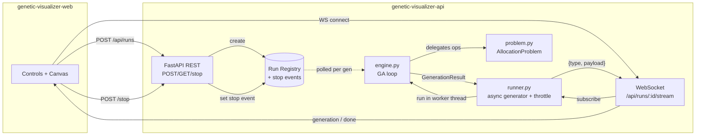

# Genetic-Algorithm Visualizer — API

Streaming genetic-algorithm backend that optimizes **store-item allocation**:
place N catalog items into M shelf slots to maximize expected sales, subject to
capacity and category-adjacency constraints. Each run streams **every
generation** over a WebSocket so the web client can animate a population
converging toward an optimal shelf layout.

> This is a portfolio reconstruction of the genetic-algorithm ML services I
> built at **Xpectrum** to optimize store-item allocation. The production
> system was a headless optimizer wired into a data pipeline; here I've kept
> the GA core faithful and wrapped it in a live, hypnotic visualization so the
> work is actually *watchable*.

## Problem

A genome is an assignment of items → shelf slots (a permutation when
`items == slots`). Fitness is fully vectorized over the whole population:

```
fitness(genome) =  Σ_slot  affinity[item_at_slot, slot] · demand[item_at_slot]
                 − capacity_penalty  · duplicate_placements
                 − adjacency_penalty · category_changes_between_neighbors
```

The affinity matrix, per-item demand and per-item category are generated
deterministically from a seed, so a given problem configuration is a stable
fitness landscape across runs and processes. The task is **pluggable**: the
engine only speaks a small `Problem` protocol (`random_genome`, `fitness`,
`crossover`, `mutate`, `render_spec`, `describe`), with `AllocationProblem` as
the built-in.

## Architecture



The GA is CPU-bound numpy work, so it runs in a **worker thread**; the async
side consumes `GenerationResult`s through an `asyncio.Queue` and forwards them
to the socket. The event loop never blocks, and a shared run registry lets
`POST /api/runs/:id/stop` set a `threading.Event` the loop polls once per
generation.

## API

Base path `/api`.

| Method | Path | Result |
| --- | --- | --- |
| `POST` | `/api/runs` | `201 { runId }` |
| `GET` | `/api/runs/:id` | `{ runId, status, params, bestFitness }` |
| `POST` | `/api/runs/:id/stop` | `200 { status }` |
| `GET` | `/api/problems` | problem metadata for building UI controls |
| `WS` | `/api/runs/:id/stream` | one `generation` message per generation + final `done` |

WebSocket messages are `{ type, payload }`:

- `generation` → `{ gen, bestFitness, avgFitness, worstFitness, diversity, bestGenome, renderSpec }`
- `done` → `{ gen, bestFitness, bestGenome, renderSpec, elapsedMs }`
- `error` → `{ message }`

A run's GA starts when the WebSocket connects (single consumer), so the stream
never misses a generation and nothing is buffered without a reader.

## Key decisions & trade-offs

| Decision | Why | Trade-off |
| --- | --- | --- |
| **Stream one message per generation, throttled to ≤~30/s** | The visualization *is* the per-generation signal; the frontend animates it. Throttling by wall-clock caps socket/CPU pressure for 2000-generation runs. | Some intermediate generations are dropped for the UI. The engine still computes every generation, and the terminal state is always delivered before `done`. |
| **numpy-vectorized fitness over the whole population** | Fitness is a fancy-indexed gather (`revenue[pop, slot]`) plus a couple of reductions — one op over a `[pop, length]` matrix instead of a Python loop. This mirrors the hot path that mattered in production. | Genomes must share a fixed length and integer encoding. |
| **Pluggable `Problem` protocol** | The engine owns *search*, the problem owns *semantics*. Swapping allocation for TSP/knapsack is five methods, and the engine code never changes. | A thin indirection cost and the discipline of keeping operators problem-side (e.g. permutation-preserving OX + swap mutation). |
| **Worker thread for the CPU-bound GA, asyncio for I/O** | The GA is numpy-heavy CPU work; running it in the event loop would stall every other connection. A thread + `asyncio.Queue` keeps the loop responsive and streaming smooth. numpy releases the GIL for the array ops that dominate. | Pure-Python sections still hold the GIL; true multi-run parallelism needs processes (see below). |
| **Elitism guarantees monotonic best-fitness** | Carrying the top-k genomes untouched means the best solution can never regress — visually the "best" line only ever climbs, which is both correct and satisfying to watch. | Slightly higher selection pressure; mitigated by tournament/roulette diversity. |
| **In-memory run registry** | Zero infra for a single-process portfolio demo; stop is a `threading.Event`. | Runs don't survive a restart and don't scale past one process (see below). |

## What I'd change at scale

- **Distributed island model.** Run several populations in parallel with
  periodic migration of elites between islands. It parallelizes cleanly and
  improves exploration — the natural next step for large `generations`.
- **Ray / Celery workers.** Move GA execution off the API process onto a pool
  of workers (Ray actors per island, or Celery tasks), with the API as a thin
  streaming gateway. This is roughly how the Xpectrum optimizer was scheduled
  against the data pipeline.
- **Persist runs.** Back the registry with Redis (live status + last-N
  generations for reconnect/replay) and Postgres/object storage for completed
  runs, so results survive restarts and the UI can replay a past run.
- **Backpressure by demand.** Instead of a fixed 30/s cap, drive emission from
  client acks / `requestAnimationFrame` timing so slow clients get coarser
  streams automatically.

## Local dev quickstart

```bash
# 1. Install (Python 3.12)
pip install -r requirements.txt      # or: make install

# 2. Run the API with hot reload → http://localhost:8000
make dev                             # uvicorn app.main:app --reload

# 3. Test
pytest                               # or: make test

# 4. Docker
make docker-build && make docker-run
```

Configuration lives in `.env` (see `.env.example`): `HOST`, `PORT`,
`CORS_ORIGINS`.

## Layout

```
app/                FastAPI app, routers, run registry, pydantic schemas
  main.py           app wiring + CORS + health
  schemas.py        RunParams and response models (pydantic v2)
  registry.py       in-memory run registry with stop events
  routers/          runs (REST + WS) and problems
ga/                 the genetic-algorithm core
  problem.py        Problem protocol + AllocationProblem (vectorized fitness)
  engine.py         seedable GA loop (tournament/roulette, crossover, elitism)
  runner.py         async generator: worker thread → asyncio.Queue → throttle
tests/              pytest: engine invariants, problem validity, stream protocol
```
