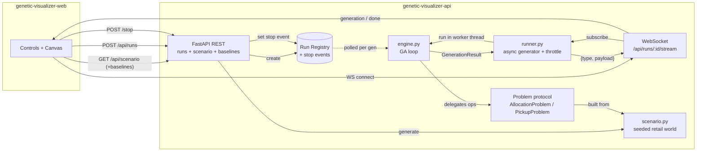

# Genetic-Algorithm Visualizer — API

Streaming genetic-algorithm backend with two built-in problems. The flagship
demo is **grocery pickup** — pick which store supplies each item on a shopping
list, trading route length against basket price against number of stops — and
the original **store-item allocation** problem stays available. Each run
streams **every generation** over a WebSocket so the web client can animate a
population converging toward the optimal plan.

> This is a portfolio reconstruction of the genetic-algorithm ML services I
> built at **Xpectrum** to optimize store-item allocation. The production
> system was a headless optimizer wired into a data pipeline; here I've kept
> the GA core faithful and wrapped it in a live, hypnotic visualization so the
> work is actually *watchable*.

**📖 API docs:** [interactive Swagger UI](https://jonathandavid.github.io/genetic-visualizer-api/)
— the OpenAPI spec is regenerated from the FastAPI code on every push (the WebSocket
stream, which OpenAPI can't express, is documented in the spec's description). Locally:
`/docs` on the running server.

## Problems

### Pickup (v2, the flagship demo)

A deterministic retail scenario is generated from a seed: M stores placed on
a 2-D km map around a customer at the origin (realistic names — "Mercado
Norte", "Super Costa"…), P grocery products with COP prices varying ±15% per
store, per-store inventories with stock, and a shopping list of N needed
products that is guaranteed coverable. A genome has one gene per needed item:
the index of the store that supplies it (only stores stocking the item are
valid; foreign genes are repaired). Fitness to maximize:

```
fitness(genome) = -( routeKm · kmCost  +  itemCostCents · centsScale  +  storesUsed · stopPenalty )
```

where the route is customer → selected stores in nearest-neighbor order →
customer, and travel time assumes 30 km/h urban speed.

**Why this scenario teaches.** A visitor who has never seen a GA can read the
map: dots are stores, the list is what I need, the line is my trip. The three
cost terms pull against each other — the cheapest basket wants many stores,
the shortest trip wants one — so watching the fitness line climb *is* watching
the algorithm negotiate that trade-off, and the baselines endpoint (random vs
greedy nearest-store) gives the audience an intuition anchor: the GA visibly
beats both.

**Custom scenario (real-order integration).** For the retail app to optimize
an *actual* order, `problemConfig` may carry an explicit `scenario` object
(`{ customer, stores:[{id,name,x,y,inventory:[{sku,priceCents,stock}]}],
shoppingList:[{sku,qty}] }`). When present it is used **verbatim** instead of
the seed generator; every shopping-list SKU must be stocked by at least one
store or the request is rejected with `422` and a clear message. `qty`
participates in `itemCostCents` (Σ qty · chosen-store price), the customer need
not sit at the origin, and the genome / fitness / `renderSpec` / metric shapes
are identical to the seeded case. `POST /api/scenario/baselines` accepts the
same explicit scenario in its body and returns `{ random, greedy }` so a caller
can benchmark its own world. Meaningful optimization needs headroom — items
available in multiple stores — so a naive per-item-nearest plan scatters across
stops and the GA can consolidate; a single-store order is honestly "already
optimal".

### Allocation (v1)

A genome is an assignment of items → shelf slots (a permutation when
`items == slots`). Fitness is fully vectorized over the whole population:

```
fitness(genome) =  Σ_slot  affinity[item_at_slot, slot] · demand[item_at_slot]
                 − capacity_penalty  · duplicate_placements
                 − adjacency_penalty · category_changes_between_neighbors
```

The affinity matrix, per-item demand and per-item category are generated
deterministically from a seed, so a given problem configuration is a stable
fitness landscape across runs and processes. The task is **pluggable**: the
engine only speaks a small `Problem` protocol (`random_genome`, `fitness`,
`crossover`, `mutate`, `render_spec`, `describe`), with `AllocationProblem` as
the built-in.

## Architecture



The GA is CPU-bound numpy work, so it runs in a **worker thread**; the async
side consumes `GenerationResult`s through an `asyncio.Queue` and forwards them
to the socket. The event loop never blocks, and a shared run registry lets
`POST /api/runs/:id/stop` set a `threading.Event` the loop polls once per
generation.

## API

Base path `/api`.

| Method | Path | Result |
| --- | --- | --- |
| `POST` | `/api/runs` | `201 { runId }` |
| `GET` | `/api/runs/:id` | `{ runId, status, params, bestFitness }` |
| `POST` | `/api/runs/:id/stop` | `200 { status }` |
| `GET` | `/api/problems` | problem metadata for building UI controls |
| `GET` | `/api/scenario?seed=&stores=&products=&needs=` | the deterministic pickup scenario (map + inventories + shopping list) |
| `GET` | `/api/scenario/baselines?seed=&...` | `{ random, greedy }` reference plans for a seeded scenario |
| `POST` | `/api/scenario/baselines` | `{ random, greedy }` for an explicit scenario in the body |
| `WS` | `/api/runs/:id/stream` | one `generation` message per generation + final `done` |

Runs accept `"problem": "pickup"` with `problemConfig: { seed, stores,
products, needs }` (stores 3–12, products 6–30, needs 3–10) — or an explicit
`problemConfig: { scenario: {…} }` to optimize a real order verbatim — or
`"problem": "allocation"` with `{ items, slots }`. The pickup `renderSpec` is
`{ selection: {sku→storeId}, route: [storeId…], routeKm, itemCostCents,
storesUsed, travelMinutes }` — everything the map/story UI needs.

WebSocket messages are `{ type, payload }`:

- `generation` → `{ gen, bestFitness, avgFitness, worstFitness, diversity, bestGenome, renderSpec }`
- `done` → `{ gen, bestFitness, bestGenome, renderSpec, elapsedMs }`
- `error` → `{ message }`

A run's GA starts when the WebSocket connects (single consumer), so the stream
never misses a generation and nothing is buffered without a reader.

## Key decisions & trade-offs

| Decision | Why | Trade-off |
| --- | --- | --- |
| **Stream one message per generation, throttled to ≤~30/s** | The visualization *is* the per-generation signal; the frontend animates it. Throttling by wall-clock caps socket/CPU pressure for 2000-generation runs. | Some intermediate generations are dropped for the UI. The engine still computes every generation, and the terminal state is always delivered before `done`. |
| **numpy-vectorized fitness over the whole population** | Fitness is a fancy-indexed gather (`revenue[pop, slot]`) plus a couple of reductions — one op over a `[pop, length]` matrix instead of a Python loop. This mirrors the hot path that mattered in production. | Genomes must share a fixed length and integer encoding. |
| **Pluggable `Problem` protocol** | The engine owns *search*, the problem owns *semantics*. Swapping allocation for TSP/knapsack is five methods, and the engine code never changes. | A thin indirection cost and the discipline of keeping operators problem-side (e.g. permutation-preserving OX + swap mutation). |
| **Worker thread for the CPU-bound GA, asyncio for I/O** | The GA is numpy-heavy CPU work; running it in the event loop would stall every other connection. A thread + `asyncio.Queue` keeps the loop responsive and streaming smooth. numpy releases the GIL for the array ops that dominate. | Pure-Python sections still hold the GIL; true multi-run parallelism needs processes (see below). |
| **Elitism guarantees monotonic best-fitness** | Carrying the top-k genomes untouched means the best solution can never regress — visually the "best" line only ever climbs, which is both correct and satisfying to watch. | Slightly higher selection pressure; mitigated by tournament/roulette diversity. |
| **In-memory run registry** | Zero infra for a single-process portfolio demo; stop is a `threading.Event`. | Runs don't survive a restart and don't scale past one process (see below). |
| **Deterministic seeded scenario + baselines** | The pickup world is a pure function of `(seed, stores, products, needs)`, so REST, GA runs and the web's demo mode all agree on the same map, and random/greedy baselines give visitors an intuition anchor the GA visibly beats. | Scenario realism is bounded by the generator; nearest-neighbor routing is a heuristic (fine at ≤12 stops, and identical for GA and baselines so comparisons stay fair). |

## What I'd change at scale

- **Distributed island model.** Run several populations in parallel with
  periodic migration of elites between islands. It parallelizes cleanly and
  improves exploration — the natural next step for large `generations`.
- **Ray / Celery workers.** Move GA execution off the API process onto a pool
  of workers (Ray actors per island, or Celery tasks), with the API as a thin
  streaming gateway. This is roughly how the Xpectrum optimizer was scheduled
  against the data pipeline.
- **Persist runs.** Back the registry with Redis (live status + last-N
  generations for reconnect/replay) and Postgres/object storage for completed
  runs, so results survive restarts and the UI can replay a past run.
- **Backpressure by demand.** Instead of a fixed 30/s cap, drive emission from
  client acks / `requestAnimationFrame` timing so slow clients get coarser
  streams automatically.

## Local dev quickstart

```bash
# 1. Install (Python 3.12)
pip install -r requirements.txt      # or: make install

# 2. Run the API with hot reload → http://localhost:8000
make dev                             # uvicorn app.main:app --reload

# 3. Test
pytest                               # or: make test

# 4. Docker
make docker-build && make docker-run
```

Configuration lives in `.env` (see `.env.example`): `HOST`, `PORT`,
`CORS_ORIGINS`.

## Layout

```
app/                FastAPI app, routers, run registry, pydantic schemas
  main.py           app wiring + CORS + health
  schemas.py        RunParams and response models (pydantic v2)
  registry.py       in-memory run registry with stop events
  routers/          runs (REST + WS), problems, scenario + baselines
ga/                 the genetic-algorithm core
  problem.py        Problem protocol + AllocationProblem (vectorized fitness)
  scenario.py       deterministic seeded retail world for the pickup problem
  pickup.py         PickupProblem: repair, NN routing, baselines, renderSpec
  engine.py         seedable GA loop (tournament/roulette, crossover, elitism)
  runner.py         async generator: worker thread → asyncio.Queue → throttle
tests/              pytest: engine invariants, problem validity, scenario
                    determinism, baselines, stream protocol
```
